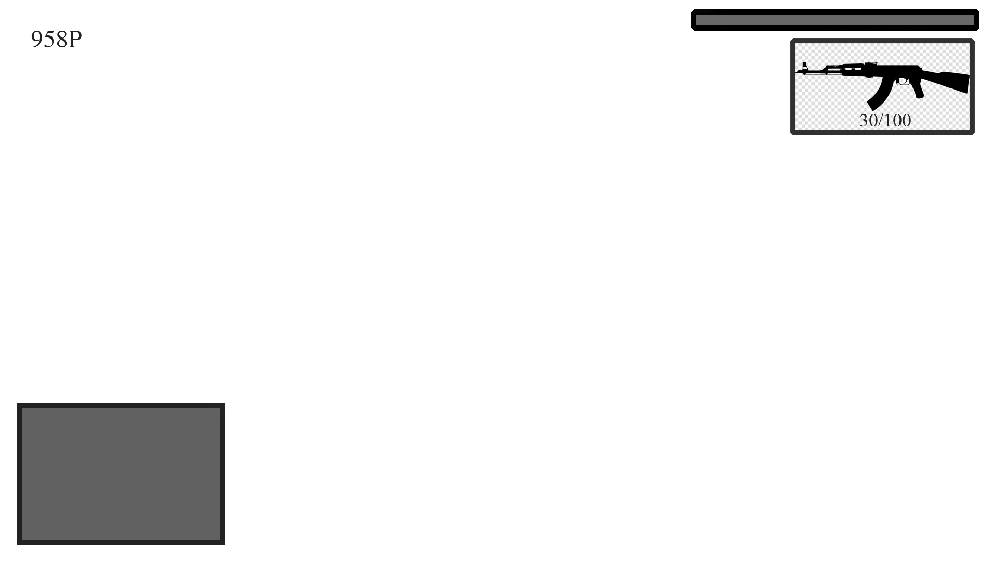

*Game Design Document*
**“Gopnik Game”**

***Краткое описание***

●	Сюжетная игра, санд-бокс, открытый мир, экшн

●	Бизнес-модель - Buy-to-play (средний ценовой сегмент)

●	Аудитория: 16+.

Однопользовательская экшн, сюжетная игра для ПК, суть которой заключается в вовлечении игрока во внутри игровой мир, похожий на реальную Россию. Цель – прохождение основных и побочных миссий, получение удовольствия от процесса погружения.
Технологии: Unity, .NET Core, Git, ~MagicaVoxel~, Quxel(Bridge,Megascans,Mixer), Substance Painter, 3Ds Max, Blender.
Библиотека звуков: noise fx.
Библиотека анимаций: mixamo.

***Базовый геймплей***

Главное меню
После запуска игры открывается главное меню, из которого можно перейти в игру с предыдущего сохранения или начать новую игру, зайти в настройки, выйти из игры. 

Ход игры
При первом заходе в игру запускается первая миссия и катсцена вводящая игрока в повествование истории, при выполнении определенных действий процесс сохраняется, иначе запускается предыдущее сохранение, при выполнении заданных условий миссия заканчивается. Между миссиями игроку предоставляется возможность исследовать мир и делать все что захочется, также игрок в это время может начать побочную миссию.

***HUD или интерфейс базовой игры***

Game Screen: 

*	Hp bar
*	Выбранное оружие и количество паторнов к нему
*	Количество денег и вещей в инвентаре
*	Карта

Main Menu:

*	Кнопка «играть»
*	Кнопка «новая игра»
*	Кнопка «настройки»
*	Кнопка «выход»

***Геймплэй-фичи***

Взаимодействие игрока с игровым миром:

●	Вокруг игрока "спавнятся" машины, люди, предметы, при удалении на достаточную дистанцию они уничтожаются

●	Игрок при нарушении правил общественного порядка пугает окружающих людей, создает между ними конфликт(пытаются бить или стрелять) или окружающие звонят в полицию.

●	Чем больше игрок совершает преступлений, тем больше уровень розыска полиции.

●	Чтоб оторваться от полиции, нужно не попадаться на глаза в течении некоторого времяни

●	У игрока есть показатели еды и здоровья, чтоб их пополнить можно купить еды в магазине.

●	В магазине можно купить еду и оружие, для того чтобы купить что-либо нужно это взять и прийти на кассу, оплатить покупку

●	Изначально у игрока нет огнестрельного оружия, далее по прохождению он может найти его на улице, выбить с врагов, купить

●	Для того чтобы начать миссию нужно прийти на отмеченный маркер на карте

●	На карте отображаются дороги, дом и авто главного героя, метки миссий
